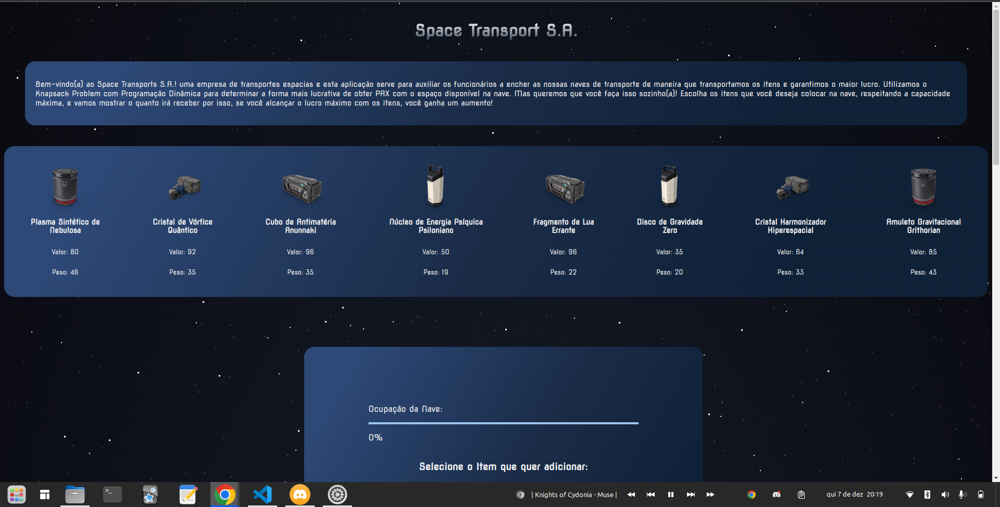
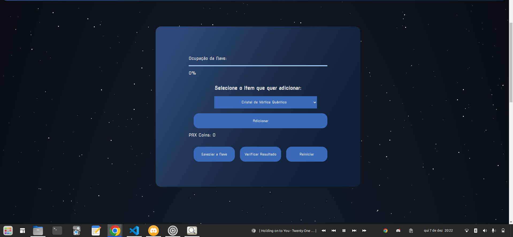
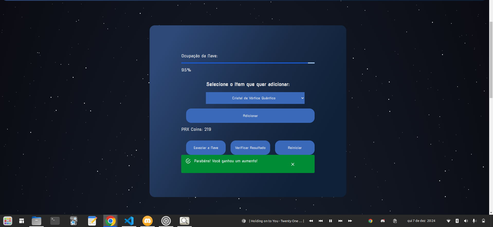
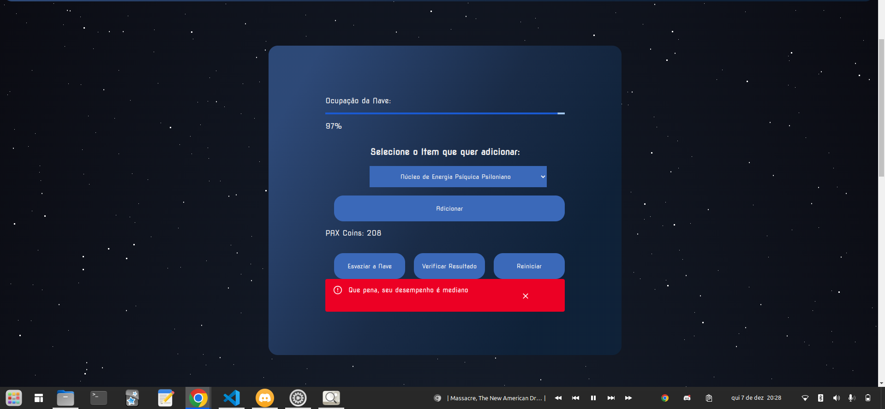

# Space Transport S.A.

**Conteúdo da Disciplina**: Programação Dinâmica (Final) <br>

## Alunos
|Matrícula | Aluno |
| -- | -- |
| 21/1039662  |  Pedro Henrique da Silva Melo |
| 20/2063300  |  João Pedro Rodrigues Morbeck |

## Sobre 
O nosso projeto envolve utilizar do algoritmo do Knapsack Problem em um contexto de um mini-jogo onde queremos armazenar itens espaciais e diversos dentro da nossa nave Space Transprt S.A que vai ser a nossa referência equivalente à mochila/sacola que o problema do Knapsack trabalha. 

Com isso, desenvolvemos uma aplicação em que é gerado para o usuário um conjunto de 8 itens que ele pode escolher para colocar na nave espacial, sendo que há um limite de ocupação de até 100 de peso para a nave. Assim,  usuário seleciona uma quantia específica de itens para adicionar e ganha uma certa quantidade de PAX Coins, a moeda de valor que esses itens apresentam. 

O desafio é fazer com que o usuário preencha a nave com os itens de forma a obter a maior quantidade  de PAX coins possíveis.

O vídeo de apresentação pode ser encontrado no seguinte link

## Screenshots



<center>

Figura 1: Tela Inicial

</center>




<center>

Figura 2: Opções de Comandos

</center>



<center>

Figura 3: Vitória após preencher a nave com o máximo valor e pesos possíveis

</center>



<center>

Figura 4: Derrota após não preencher a nave com o máximo ganho possível de valor

</center>

## Instalação 
**Linguagem**: Javascript<br>
**Framework**: React.js<br>

É necessário ter Node.js instalado (recomendado versão 18 ou posterior) que pode ser baixado [aqui](https://nodejs.org/en), na pasta do projeto, execute o seguinte comando.

``` bash
npm install
```

``` bash
npm run dev
```

o projeto estará no https://localhost:5173


## Uso 
O usuário começa com a disposição dos itens que ele pode escolher para colocar em sua Space Transport S.A onde é apresentado seus valores e pesos. Com isso, ele deve selecionar algum dos itens pela lista de itens apresentados na interface. Após isso, ele pode ir adicionando esses itens e observando a quantidade de PAX Coins que está ganhando, assim como ver o quanto já ocupou de espaço na nave. 

O usuário pode ter noção da solução ótima ao executar o algoritmo do knapsack com os valores e pesos dos itens que são apresentados. Ele pode reiniciar essas variáveis com o uso do botão reiniciar quando se sentir a vontade.

Ao preencher a nave com os itens desejados, o usuário pode apertar o botão "Verificar Resultado" e assim ele obterá um feedback que vai mostrar se ele preencheu a nave com o máximo de valor a se ganhar com os pesos disponíveis, ou seja, se ele ganhou o jogo. Caso iss não tenha ocorrido, então ele recebe um aviso de que não preencheu a nave com a solução ótima e nisso terá perdido o jogo!

Para ele continuar a jogar e tentar, ele pode esvaziar a nave já ocupada para tentar novamente com os mesmos valores e pesos apresentados. Caso contrário, ele pode optar por reiniciar os valores e pesos com o botão "Reiniciar".

Explique como usar seu projeto caso haja algum passo a passo após o comando de execução.

